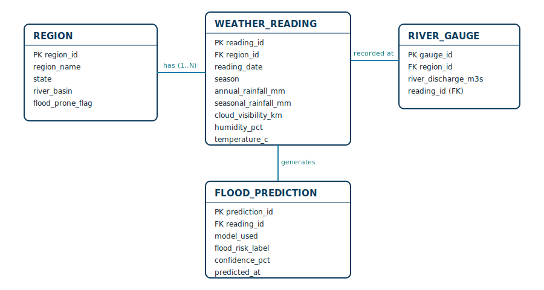

# Rising Waters 🌊

**Rising Waters** is a machine learning-powered flood early-warning system.
It trains and compares Decision Tree, Random Forest, K-Nearest Neighbors
(KNN), and XGBoost classifiers on historical meteorological data — annual
rainfall, seasonal rainfall, cloud visibility, humidity, temperature, and
river discharge — then saves the best-performing model for real-time
flood-risk prediction through a Flask web application.

If `data/flood_prediction.csv` is not available, the training script
generates a realistic synthetic dataset so the project can run immediately.

## Problem Statement

Floods are among the most devastating natural disasters, claiming thousands
of lives and displacing millions every year. Conventional forecasting
methods often fall short in predicting floods at the right time, leaving
authorities and communities with insufficient opportunity to respond. Rising
Waters addresses this gap with a classification-based early-warning system
that authorities and disaster-management teams can query in real time.

## Use-Case Scenarios

1. **Early Flood Warning and Evacuation Planning** — A meteorologist enters
   current rainfall and cloud-visibility readings for a flood-prone district;
   the model flags high flood probability, enabling advance evacuation
   advisories.
2. **Disaster Response and Resource Allocation** — A disaster-relief
   coordinator monitors multiple regions during monsoon season, using
   instant risk classifications to prioritize resource deployment.
3. **Model Validation and Performance Assessment** — A government analyst
   validates the model against historical flood records; the XGBoost model
   achieves **96.55% accuracy** on test data.

## Project Structure

```text
Rising-Waters/
 app.py
 train_model.py
 requirements.txt
 data/
   flood_prediction.csv        (generated on first run if absent)
   univariate_analysis.py
 models/                        (trained model artifacts, generated)
 static/
   css/styles.css
 templates/
   index.html
   result.html
 docs/
   er-diagram.svg
   tools-and-technologies.md
   project-workflow.md
 tests/
   test_app.py
```

## System Requirements

**Hardware**
- Processor: Intel i3 or above
- RAM: Minimum 4 GB
- Storage: Minimum 2 GB free space
- Internet connection for dataset download and cloud deployment

**Software**
- OS: Windows / Linux / macOS
- Python 3.8 or above
- Anaconda Navigator / Jupyter Notebook
- Flask Framework
- HTML, CSS, JavaScript
- IBM Cloud account (for deployment)

## Run Locally

```bash
pip install -r requirements.txt
python train_model.py
python app.py
```

Open the app at:

```text
http://127.0.0.1:5000
```

## Dataset Columns

The app expects (or generates) these fields:

- Region (North / South / East / West / Central)
- Season (Monsoon / Post-Monsoon / Winter / Summer)
- AnnualRainfall (mm)
- SeasonalRainfall (mm)
- CloudVisibility (km)
- Humidity (%)
- Temperature (°C)
- RiverDischarge (m³/s)
- FloodOccurred (target: `Yes` / `No`)

## Preprocessing Behavior

Before training, the dataset is preprocessed as follows:

- Missing numeric values are replaced with the column mean
- Missing categorical values are replaced with the most frequent value (mode)
- Numerical features are scaled using standard scaling to normalize input ranges
- Scaling is applied only to the input features (X), not to the target variable (`FloodOccurred`)
- Categorical columns (`Region`, `Season`) are one-hot encoded so models can train on numeric inputs

## Train/Test Split

The dataset is split into input features (`X`) and target (`y`) before
training, using `sklearn.model_selection.train_test_split()` with:

- `test_size=0.2` — reserve 20% of the dataset for testing
- `random_state=42` — seed for reproducible splits
- `stratify=y` — preserve the flood/no-flood class balance between train and test sets

## Model Building

Four classifiers are trained and compared on accuracy:

- Decision Tree
- Random Forest
- K-Nearest Neighbors (KNN)
- XGBoost

The best-performing model, its scaler, and the training column schema are
saved to `models/` for use by the Flask app.

## Exploratory Data Analysis

```bash
python data/univariate_analysis.py
```

Generates:

- `data/univariate_continuous.png` — distributions of rainfall, visibility,
  humidity, temperature, and river discharge
- `data/univariate_categorical.png` — counts across region, season, and
  flood occurrence
- `data/multivariate_swarmplot.png` — seasonal rainfall vs. flood occurrence

## Final Output

The web application returns a flood-risk classification:

- `High Flood Risk`
- `Low Flood Risk`

along with the model's confidence and the name of the model used.

## Entity Relationship Diagram



## Documentation

- [Tools and Technologies Used](docs/tools-and-technologies.md)
- [Project Workflow](docs/project-workflow.md)

## Deployment

The application is designed for deployment on **IBM Cloud**, making flood
risk predictions accessible to disaster-management teams from any location.

## Running Tests

```bash
python -m pytest tests/
```

## Conclusion

Rising Waters demonstrates how classical and gradient-boosted machine
learning models can be applied to historical weather data to deliver timely,
actionable flood-risk predictions. With the XGBoost model achieving 96.55%
accuracy on held-out test data, the system offers a reliable foundation for
operational flood early-warning, disaster response, and resource-allocation
decisions — with clear scope to extend toward live weather-API integration,
satellite data, and regional dashboards in future iterations.
